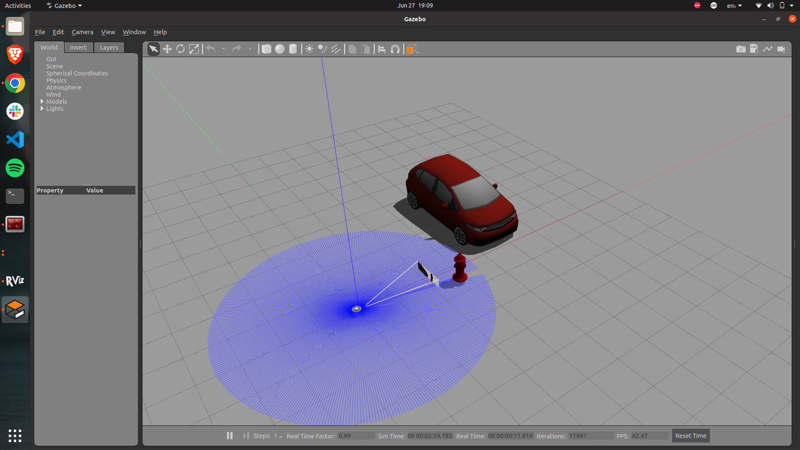
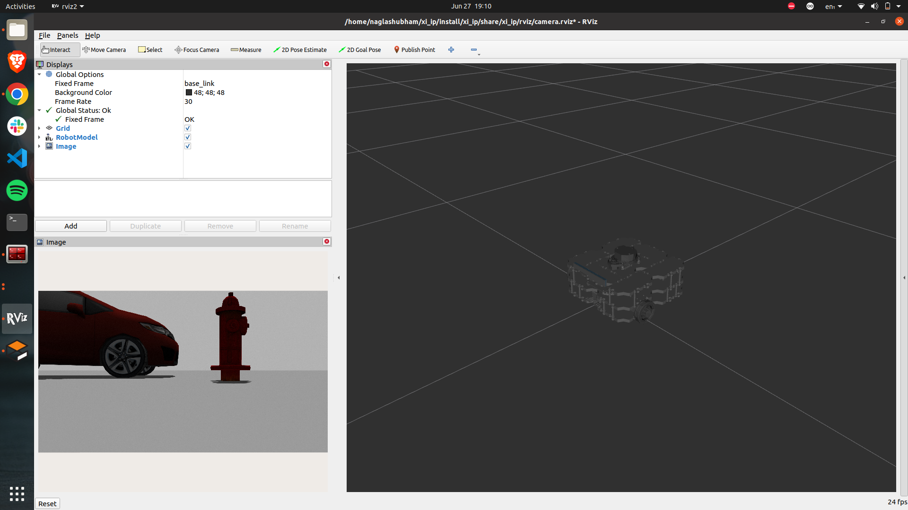
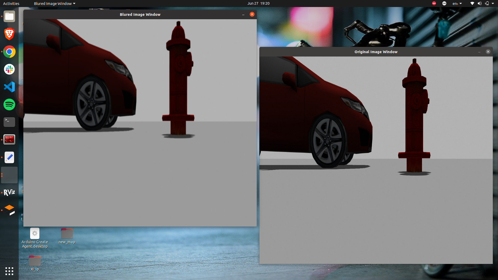

# xilinx_ip
xilinx Image Processing Task

>Instruction For Building the Package

```bash
$ mkdir -p ~/xi_ws/src
$ cd ~/xi_ws/src

$ git clone https://github.com/shubhamnagla/xi_ip.git
$ git clone -b foxy-devel https://github.com/ROBOTIS-GIT/DynamixelSDK.git
$ git clone -b foxy-devel https://github.com/ROBOTIS-GIT/turtlebot3_msgs.git
$ git clone -b foxy-devel https://github.com/ROBOTIS-GIT/turtlebot3.git
$ git clone -b foxy-devel https://github.com/ROBOTIS-GIT/turtlebot3_simulations.git
$ cd ~/xi_ws
$ colcon build --symlink-install
$ rosdep update
Ignore if you receive any error for the following
$ rosdep install -i --from-path src --rosdistro foxy -y
```

> For launching the whole simulation and task 
```bash
$ cd ~/xi_ws
$ . install/setup.bash
$ export TURTLEBOT3_MODEL=waffle
$ ros2 launch xi_ip xi_ip.launch.xml
```
> Gazebo


>Rviz


>OpenCV Windows

